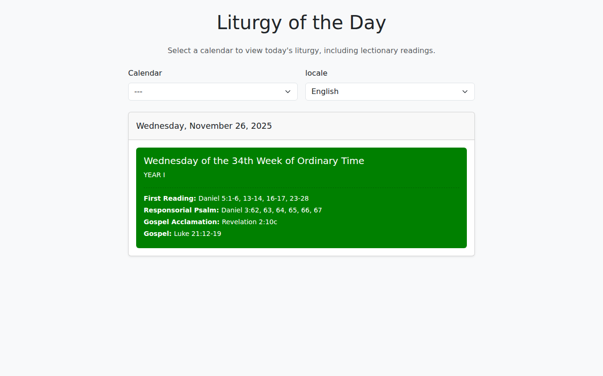
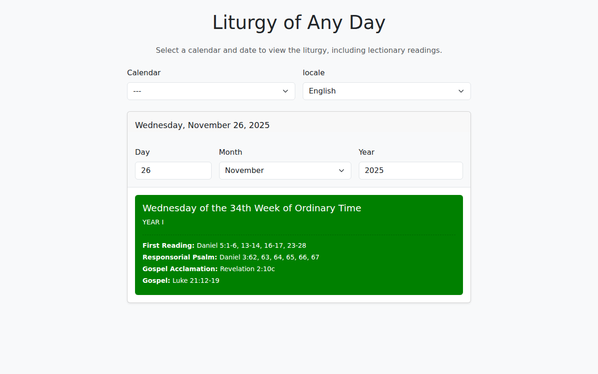

# Liturgy Components

The library provides two components for displaying liturgical events: `LiturgyOfTheDay` for today's liturgy
and `LiturgyOfAnyDay` for browsing any date.

## LiturgyOfTheDay

Displays the liturgical events for today's date.



### Basic Usage

```javascript
import { ApiClient, LiturgyOfTheDay } from '@liturgical-calendar/components-js';

ApiClient.init('http://localhost:8000').then((apiClient) => {
    const liturgyOfTheDay = new LiturgyOfTheDay('en-US');
    liturgyOfTheDay
        .id('LiturgyOfTheDay')
        .class('liturgy-widget')
        .listenTo(apiClient);
    liturgyOfTheDay.replace('#liturgyOfTheDay');

    apiClient.fetchCalendar('en');
});
```

### Configuration Methods

| Method | Description |
|--------|-------------|
| `id(id)` | Set widget element ID |
| `class(className)` | Set widget CSS class(es) |
| `titleClass(className)` | Set title element CSS class(es) |
| `dateClass(className)` | Set date string CSS class(es) |
| `eventsWrapperClass(className)` | Set events wrapper CSS class(es) |
| `eventClass(className)` | Set event elements CSS class(es) |
| `eventGradeClass(className)` | Set liturgical grade CSS class(es) |
| `eventCommonClass(className)` | Set common (saint type) CSS class(es) |
| `eventYearCycleClass(className)` | Set year cycle CSS class(es) |
| `readingsWrapperClass(className)` | Set readings wrapper CSS class(es) |
| `readingsLabelClass(className)` | Set readings label CSS class(es) |
| `readingClass(className)` | Set individual reading CSS class(es) |
| `showReadings(bool=true)` | Show/hide lectionary readings |
| `listenTo(apiClient)` | Listen to calendarFetched events |

### DOM Insertion (non-chainable)

| Method | Description |
|--------|-------------|
| `appendTo(selector)` | Append to specified DOM element |
| `replace(selector)` | Replace specified DOM element |

### Year Type Handling

By default, `year_type=LITURGICAL` is fetched. To ensure all events display throughout the year:

```javascript
import { ApiClient, LiturgyOfTheDay, YearType } from '@liturgical-calendar/components-js';

// Option 1: Use CIVIL year type
apiClient.yearType(YearType.CIVIL).fetchCalendar('en');

// Option 2: Handle edge cases dynamically (recommended)
// See examples/LiturgyOfTheDay for full implementation
```

> [!TIP]
> With `LITURGICAL` year type, events after Saturday of the 34th week of Ordinary Time won't show.
> With `CIVIL` year type, the Vigil Mass for Mary, Mother of God won't show on December 31st.
> See `examples/LiturgyOfTheDay` for handling both cases.

---

## LiturgyOfAnyDay

Displays liturgical events for any selected date, with day/month/year controls.



### Basic Usage

```javascript
import { ApiClient, LiturgyOfAnyDay } from '@liturgical-calendar/components-js';

ApiClient.init('http://localhost:8000').then((apiClient) => {
    const liturgyOfAnyDay = new LiturgyOfAnyDay('en-US');
    liturgyOfAnyDay
        .id('liturgyOfAnyDay')
        .class('card shadow')
        .buildDateControls()
        .listenTo(apiClient);
    liturgyOfAnyDay.appendTo('#liturgyContainer');

    apiClient.fetchCalendar('en');
});
```

### Configuration Methods

Includes all `LiturgyOfTheDay` methods plus:

| Method | Description |
|--------|-------------|
| `dateControlsClass(className)` | Set date controls wrapper CSS class(es) |
| `dayInputConfig(options)` | Configure day input |
| `monthInputConfig(options)` | Configure month input |
| `yearInputConfig(options)` | Configure year input |
| `buildDateControls()` | Build and append date controls (must be called after config) |

### Input Configuration Options

```javascript
liturgyOfAnyDay
    .dayInputConfig({
        wrapper: 'div',
        wrapperClass: 'col-md-4',
        class: 'form-control',
        labelClass: 'form-label',
        labelText: 'Day'
    })
    .monthInputConfig({
        wrapper: 'div',
        wrapperClass: 'col-md-4',
        class: 'form-select',
        labelClass: 'form-label',
        labelText: 'Month'
    })
    .yearInputConfig({
        wrapper: 'div',
        wrapperClass: 'col-md-4',
        class: 'form-control',
        labelClass: 'form-label',
        labelText: 'Year'
    })
    .buildDateControls();
```

### Automatic Year Type Handling

`LiturgyOfAnyDay` automatically handles the December 31st edge case:

- When selecting December 31st: fetches with `year_type=LITURGICAL` and `year=selectedYear+1`
- This ensures the Vigil Mass for Mary Mother of God is included
- When switching away from December 31st: reverts to `year_type=CIVIL`
- No special handling required by implementing code

### Date Change Behavior

| Change | Action |
|--------|--------|
| Day/Month | Re-renders from cached data (no API call) |
| Year | Triggers API refetch |
| December 31st transition | Triggers API refetch with appropriate year_type |

### Visual Features

- **High-contrast text**: White text on dark backgrounds (green, red, purple), black on light
- **White background border**: Events with white backgrounds have a subtle border

---

## Full Example with Bootstrap

```javascript
import {
    ApiClient,
    CalendarSelect,
    ApiOptions,
    ApiOptionsFilter,
    LiturgyOfAnyDay
} from '@liturgical-calendar/components-js';

ApiClient.init('http://localhost:8000').then((apiClient) => {
    if (!(apiClient instanceof ApiClient)) return;

    // Calendar selection
    const calendarSelect = new CalendarSelect('en-US')
        .allowNull()
        .class('form-select')
        .label({ text: 'Calendar', class: 'form-label' })
        .wrapper({ as: 'div', class: 'col-md-6' });
    calendarSelect.appendTo('#calendarOptions');
    calendarSelect._domElement.value = '';

    // Locale selection
    const apiOptions = new ApiOptions('en-US')
        .filter(ApiOptionsFilter.LOCALE_ONLY)
        .linkToCalendarSelect(calendarSelect);
    apiOptions._localeInput
        .wrapper('div')
        .wrapperClass('col-md-6')
        .class('form-select')
        .labelClass('form-label');
    apiOptions.appendTo('#calendarOptions');

    // Liturgy widget
    const liturgyOfAnyDay = new LiturgyOfAnyDay('en-US')
        .id('LiturgyOfAnyDay')
        .class('card shadow-sm')
        .titleClass('d-none')
        .dateClass('card-header py-3')
        .dateControlsClass('row g-3 p-3 bg-light border-bottom')
        .eventsWrapperClass('card-body')
        .eventClass('p-3 mb-3 rounded')
        .eventGradeClass('small')
        .eventCommonClass('small fst-italic')
        .eventYearCycleClass('small')
        .readingsWrapperClass('mt-3 pt-2')
        .readingsLabelClass('fw-bold')
        .readingClass('small')
        .showReadings(true)
        .dayInputConfig({
            wrapper: 'div',
            wrapperClass: 'col-4 col-md-3',
            class: 'form-control',
            labelClass: 'form-label',
            labelText: 'Day'
        })
        .monthInputConfig({
            wrapper: 'div',
            wrapperClass: 'col-8 col-md-5',
            class: 'form-select',
            labelClass: 'form-label',
            labelText: 'Month'
        })
        .yearInputConfig({
            wrapper: 'div',
            wrapperClass: 'col-12 col-md-4',
            class: 'form-control',
            labelClass: 'form-label',
            labelText: 'Year'
        })
        .buildDateControls()
        .listenTo(apiClient);
    liturgyOfAnyDay.replace('#liturgyOfAnyDay');

    // Wire up ApiClient
    apiClient.listenTo(calendarSelect).listenTo(apiOptions);
    apiClient.fetchCalendar('en');
});
```
