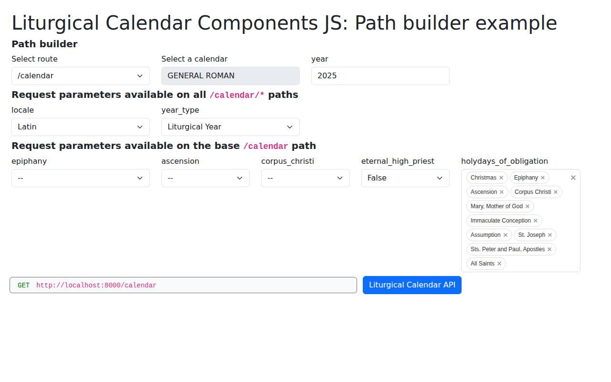

# PathBuilder

The `PathBuilder` component assists in building API `GET` request URLs by listening to `ApiOptions`
and `CalendarSelect` instances and displaying the resulting URL in real time.



## Basic Usage

```javascript
import { ApiOptions, CalendarSelect, PathBuilder } from '@liturgical-calendar/components-js';

const apiOptions = new ApiOptions('en-US');
const calendarSelect = new CalendarSelect('en-US');

const pathBuilder = new PathBuilder(apiOptions, calendarSelect);
pathBuilder.appendTo('#pathBuilder');
```

## Features

- **Text field**: Displays the current API request URL based on selections
- **Button**: Link to open the API request directly
- **Real-time updates**: URL updates as selections change

## Configuration Methods

| Method | Description |
|--------|-------------|
| `id(id)` | Set widget element ID |
| `class(className)` | Set widget CSS class(es) |
| `buttonClass(className)` | Set button CSS class(es) |
| `buttonText(text)` | Set button text |
| `buttonWrapperClass(className)` | Set button wrapper CSS class(es) |
| `pathWrapperClass(className)` | Set path display wrapper CSS class(es) |

## DOM Insertion (non-chainable)

| Method | Description |
|--------|-------------|
| `appendTo(selector)` | Append to specified DOM element |

## Example with Bootstrap Styling

```javascript
import {
    ApiClient,
    ApiOptions,
    ApiOptionsFilter,
    CalendarSelect,
    PathBuilder,
    Input
} from '@liturgical-calendar/components-js';

ApiClient.init('http://localhost:8000').then((apiClient) => {
    if (!(apiClient instanceof ApiClient)) return;

    // Configure global styling
    Input.setGlobalInputClass('form-select');
    Input.setGlobalLabelClass('form-label');
    Input.setGlobalWrapper('div');
    Input.setGlobalWrapperClass('col-md-3');

    // Calendar select
    const calendarSelect = new CalendarSelect('en-US')
        .class('form-select')
        .wrapper({ as: 'div', class: 'col-md-4' });
    calendarSelect.appendTo('#controls');

    // API options with path builder filter
    const apiOptions = new ApiOptions('en-US')
        .filter(ApiOptionsFilter.PATH_BUILDER)
        .linkToCalendarSelect(calendarSelect);
    apiOptions._yearInput.class('form-control');
    apiOptions.appendTo('#controls');

    // Path builder
    const pathBuilder = new PathBuilder(apiOptions, calendarSelect)
        .id('api-path-builder')
        .class('path-builder mb-4')
        .buttonClass('btn btn-primary')
        .buttonText('Open in API')
        .buttonWrapperClass('mt-2')
        .pathWrapperClass('bg-light p-2 rounded');
    pathBuilder.appendTo('#pathBuilderContainer');
});
```

## Full Example

See the `examples/PathBuilder` folder for a complete working example.
