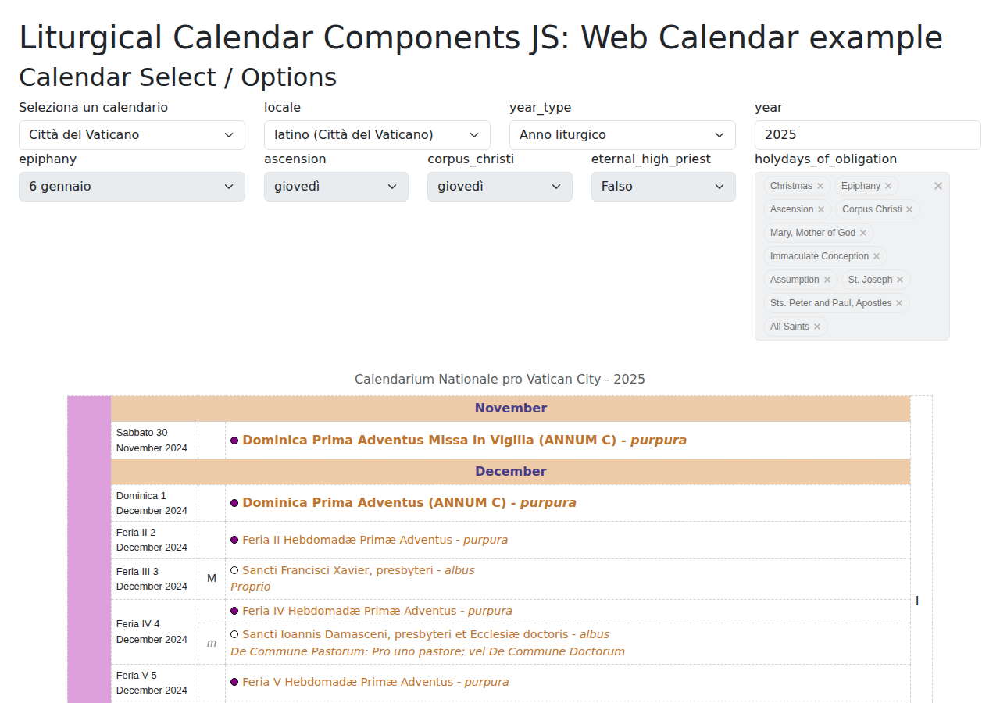

# WebCalendar

The `WebCalendar` component generates a Liturgical Calendar as an HTML table element.



## Basic Usage

```javascript
import { ApiClient, WebCalendar } from '@liturgical-calendar/components-js';

ApiClient.init('http://localhost:8000').then((apiClient) => {
    const webCalendar = new WebCalendar();
    webCalendar.listenTo(apiClient).appendTo('#litcalWebcalendar');
    apiClient.fetchCalendar('en');
});
```

## Configuration Methods

All methods are chainable:

```javascript
import {
    WebCalendar,
    Grouping,
    ColorAs,
    Column,
    ColumnOrder,
    DateFormat,
    GradeDisplay,
    LatinInterface
} from '@liturgical-calendar/components-js';

const webCalendar = new WebCalendar()
    .id('liturgical-calendar')
    .class('table table-striped')
    .firstColumnGrouping(Grouping.BY_MONTH)
    .psalterWeekColumn(true)
    .removeHeaderRow(false)
    .removeCaption(false)
    .monthHeader(true)
    .seasonColor(ColorAs.CSS_CLASS)
    .seasonColorColumns(Column.LITURGICAL_SEASON)
    .eventColor(ColorAs.INDICATOR)
    .eventColorColumns(Column.EVENT_DETAILS)
    .dateFormat(DateFormat.DAY_ONLY)
    .columnOrder(ColumnOrder.GRADE_FIRST)
    .gradeDisplay(GradeDisplay.ABBREVIATED)
    .latinInterface(LatinInterface.ECCLESIASTICAL)
    .listenTo(apiClient);

webCalendar.appendTo('#calendar-container');
```

## Configuration Reference

### Basic Settings

| Method | Description |
|--------|-------------|
| `id(id)` | Set table ID |
| `class(className)` | Set table CSS class(es) |
| `removeHeaderRow(bool=true)` | Hide the table header row |
| `removeCaption(bool=true)` | Hide the table caption |

### Grouping and Layout

| Method | Values | Description |
|--------|--------|-------------|
| `firstColumnGrouping(grouping)` | `Grouping.BY_MONTH`, `Grouping.BY_LITURGICAL_SEASON` | How to group events in the first column |
| `psalterWeekColumn(bool=true)` | boolean | Show psalter week as rightmost column |
| `monthHeader(bool=true)` | boolean | Show month header row at start of each month |
| `columnOrder(order)` | `ColumnOrder.GRADE_FIRST`, `ColumnOrder.EVENT_DETAILS_FIRST` | Order of event details and grade columns |

### Color Settings

| Method | Values | Description |
|--------|--------|-------------|
| `seasonColor(colorAs)` | `ColorAs.CSS_CLASS`, `ColorAs.BACKGROUND`, `ColorAs.INDICATOR`, `ColorAs.NONE` | How to apply liturgical season color |
| `seasonColorColumns(columns)` | `Column.*` | Which columns to apply season color to |
| `eventColor(colorAs)` | `ColorAs.CSS_CLASS`, `ColorAs.BACKGROUND`, `ColorAs.INDICATOR`, `ColorAs.NONE` | How to apply event color |
| `eventColorColumns(columns)` | `Column.*` | Which columns to apply event color to |

### Column Values

Column values can be combined with bitwise OR (`|`):

```javascript
// Apply to multiple columns
webCalendar.eventColorColumns(Column.EVENT_DETAILS | Column.GRADE);
```

| Value | Description |
|-------|-------------|
| `Column.LITURGICAL_SEASON` | Liturgical season column |
| `Column.MONTH` | Month column |
| `Column.DATE` | Date column |
| `Column.EVENT_DETAILS` | Event details column |
| `Column.GRADE` | Liturgical grade column |
| `Column.PSALTER_WEEK` | Psalter week column |
| `Column.ALL` | All columns |
| `Column.NONE` | No columns |

### Date and Display Format

| Method | Values | Description |
|--------|--------|-------------|
| `dateFormat(format)` | `DateFormat.FULL`, `DateFormat.LONG`, `DateFormat.MEDIUM`, `DateFormat.SHORT`, `DateFormat.DAY_ONLY` | Date display format |
| `gradeDisplay(display)` | `GradeDisplay.FULL`, `GradeDisplay.ABBREVIATED` | Liturgical grade display |
| `latinInterface(type)` | `LatinInterface.ECCLESIASTICAL`, `LatinInterface.CIVIL` | Latin weekday names style |

### Event Handling

| Method | Description |
|--------|-------------|
| `listenTo(apiClient)` | Listen to `calendarFetched` events from ApiClient |
| `appendTo(selector)` | Set target element and render when data arrives |

## Reactive Behavior

Unlike other components where `appendTo()` performs a one-time DOM insertion,
`WebCalendar.appendTo()` stores a reference to the target element.
When calendar data is fetched, the table is rebuilt and the target element's children are *replaced*.
This means the calendar updates automatically whenever new data arrives from the ApiClient.

## Styling with CSS Classes

The `WebCalendar` component adds CSS classes to table elements reflecting liturgical grades:

```css
/* Style events by grade */
.grade-0 { /* Commemoration */ }
.grade-1 { /* Optional Memorial */ }
.grade-2 { /* Memorial */ }
.grade-3 { /* Feast */ }
.grade-4 { /* Feast of the Lord */ }
.grade-5 { /* Solemnity */ }
.grade-6 { /* Higher Solemnity */ }
```

## Full Example

See the `examples/WebCalendar` folder for a complete working example with:
- CalendarSelect for calendar selection
- ApiOptions for API parameters
- WebCalendar listening to ApiClient
- CSS styling based on liturgical grades
