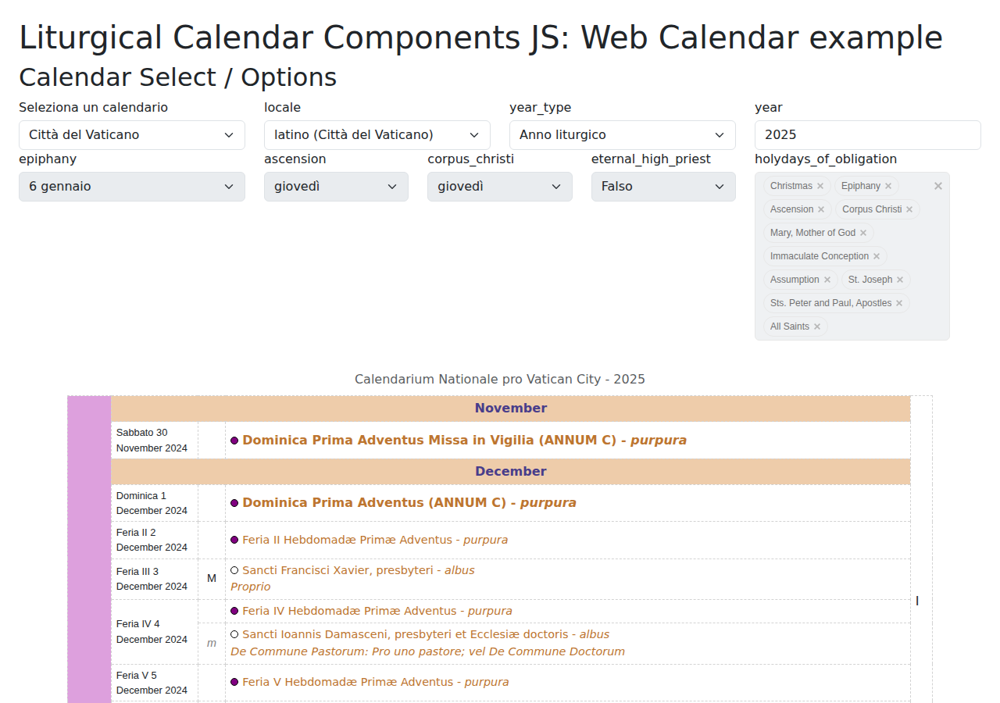

# WebCalendar

The `WebCalendar` component generates a Liturgical Calendar as an HTML table element.



## Basic Usage

```javascript
import { ApiClient, WebCalendar } from '@liturgical-calendar/components-js';

ApiClient.init('http://localhost:8000').then((apiClient) => {
    const webCalendar = new WebCalendar();
    webCalendar.listenTo(apiClient).appendTo('#litcalWebcalendar');
    apiClient.fetchCalendar('en').catch((error) => {
        console.error(`Could not fetch calendar: ${error.message}`);
    });
}).catch((error) => {
    console.error(`Could not reach the API at ${error.url ?? 'the configured base'}: ${error.message}`);
});
```

## Configuration Methods

All methods are chainable:

```javascript
import {
    WebCalendar,
    Grouping,
    ColorAs,
    Column,
    ColumnOrder,
    DateFormat,
    GradeDisplay,
    LatinInterface
} from '@liturgical-calendar/components-js';

const webCalendar = new WebCalendar()
    .id('liturgical-calendar')
    .class('table table-striped')
    .firstColumnGrouping(Grouping.BY_MONTH)
    .psalterWeekColumn(true)
    .removeHeaderRow(false)
    .removeCaption(false)
    .monthHeader(true)
    .seasonColor(ColorAs.CSS_CLASS)
    .seasonColorColumns(Column.LITURGICAL_SEASON)
    .eventColor(ColorAs.INDICATOR)
    .eventColorColumns(Column.EVENT_DETAILS)
    .dateFormat(DateFormat.DAY_ONLY)
    .columnOrder(ColumnOrder.GRADE_FIRST)
    .gradeDisplay(GradeDisplay.ABBREVIATED)
    .latinInterface(LatinInterface.ECCLESIASTICAL)
    .listenTo(apiClient);

webCalendar.appendTo('#calendar-container');
```

## Configuration Reference

### Basic Settings

| Method                       | Description               |
| ---------------------------- | ------------------------- |
| `id(id)`                     | Set table ID              |
| `class(className)`           | Set table CSS class(es)   |
| `removeHeaderRow(bool=true)` | Hide the table header row |
| `removeCaption(bool=true)`   | Hide the table caption    |

### Grouping and Layout

| Method                          | Values                                           | Description                      |
| ------------------------------- | ------------------------------------------------ | -------------------------------- |
| `firstColumnGrouping(grouping)` | `Grouping.BY_MONTH`, `BY_LITURGICAL_SEASON`      | Group events in first column     |
| `psalterWeekColumn(bool=true)`  | boolean                                          | Show psalter week rightmost col  |
| `monthHeader(bool=true)`        | boolean                                          | Show month header at month start |
| `columnOrder(order)`            | `ColumnOrder.GRADE_FIRST`, `EVENT_DETAILS_FIRST` | Order of details and grade cols  |

### Color Settings

| Method                        | Values                                         | Description               |
| ----------------------------- | ---------------------------------------------- | ------------------------- |
| `seasonColor(colorAs)`        | `ColorAs.CSS_CLASS`, `BACKGROUND`, `INDICATOR` | How to apply season color |
| `seasonColorColumns(columns)` | `Column.*`                                     | Columns for season color  |
| `eventColor(colorAs)`         | `ColorAs.CSS_CLASS`, `BACKGROUND`, `INDICATOR` | How to apply event color  |
| `eventColorColumns(columns)`  | `Column.*`                                     | Columns for event color   |

### Column Values

Column values can be combined with bitwise OR (`|`):

```javascript
// Apply to multiple columns
webCalendar.eventColorColumns(Column.EVENT_DETAILS | Column.GRADE);
```

| Value                      | Description              |
| -------------------------- | ------------------------ |
| `Column.LITURGICAL_SEASON` | Liturgical season column |
| `Column.MONTH`             | Month column             |
| `Column.DATE`              | Date column              |
| `Column.EVENT_DETAILS`     | Event details column     |
| `Column.GRADE`             | Liturgical grade column  |
| `Column.PSALTER_WEEK`      | Psalter week column      |
| `Column.ALL`               | All columns              |
| `Column.NONE`              | No columns               |

### Date and Display Format

| Method                  | Values                                                   | Description                                        |
| ----------------------- | -------------------------------------------------------- | -------------------------------------------------- |
| `dateFormat(format)`    | `DateFormat.FULL`, `LONG`, `MEDIUM`, `SHORT`, `DAY_ONLY` | Date display format                                |
| `gradeDisplay(display)` | `GradeDisplay.FULL`, `ABBREVIATED`                       | Liturgical grade display                           |
| `latinInterface(type)`  | `LatinInterface.ECCLESIASTICAL`, `CIVIL`                 | Latin weekday names style                          |
| `rite(rite)`            | `Rite.ROMAN`, `Rite.AMBROSIAN`                           | Rite the calendar belongs to, used for the caption |
| `locale(locale)`        | a `string` or an `Intl.Locale`                           | Locale for month and date formatting               |
| `announceUpdates(bool)` | `true` (default), `false`                                | Announce each replacement in a live region         |

`locale()` accepts a BCP 47 tag or an `Intl.Locale`, interchangeably, and stores the canonical form — so
`_locale` reads back `'en-US'` for `'EN-us'`, `'en_us'` or `new Intl.Locale('EN-us')` alike. Underscores are
normalized to hyphens. An unparseable, empty or blank tag throws, naming the setter. It defaults to `'en-US'`
when never called.

`rite()` affects only the caption of a **rite-level** calendar, which is otherwise indistinguishable from
the General Roman calendar: the payload carries no rite field and has neither a `national_calendar` nor a
`diocesan_calendar` setting. Without it an Ambrosian calendar is captioned "General Roman Calendar".
National and diocesan captions are named after the calendar itself and need no rite.

Calling it is unnecessary when the instance uses `listenTo(apiClient)`: the rite is taken from the client
on every fetch, so it follows a linked `RiteSelect` automatically.

### Screen-reader announcements

`WebCalendar` replaces its entire table on every `calendarFetched`, and the change is usually driven from a
`<select>` that keeps focus. Without help that is silence for a screen-reader user: nothing says the rows
underneath were replaced, and nothing distinguishes a successful update from a request that did nothing.

The table's mount therefore also carries a visually-hidden `role="status"` / `aria-live="polite"` /
`aria-atomic="true"` region, holding a short summary — never the content, which would be catastrophic to
announce:

```text
General Roman Calendar - 2026, 561 entries
```

The calendar's name and year are the very string the `<caption>` carries, so the two cannot drift, and they
are announced even when `removeCaption(true)` hides the caption element. The count is pluralized with
`Intl.PluralRules`.

Two behaviours worth knowing:

- **The first render is not announced.** It is the page loading rather than a user action, and a live region
  firing then talks over whatever else is being announced.
- **The region is never removed and re-inserted**, since a live region has to be in the DOM before its
  content changes to be announced at all. It stays as the mount's last child across every table swap, and
  the swap still clears any placeholder content the consumer left there.

Turn it off with `announceUpdates(false)`, or `new WebCalendar({ announceUpdates: false })`, when the
surrounding page already owns a live region for this content and would otherwise announce it twice.

### Event Handling

| Method                | Description                                       |
| --------------------- | ------------------------------------------------- |
| `listenTo(apiClient)` | Listen to `calendarFetched` events from ApiClient |
| `appendTo(selector)`  | Set target element and render when data arrives   |

## Reactive Behavior

Unlike other components where `appendTo()` performs a one-time DOM insertion,
`WebCalendar.appendTo()` stores a reference to the target element.
When calendar data is fetched, the table is rebuilt and the target element's children are _replaced_.
This means the calendar updates automatically whenever new data arrives from the ApiClient.

## Styling with CSS Classes

The `WebCalendar` component adds CSS classes to table elements reflecting liturgical grades:

```css
/* Style events by grade */
.grade-0 { /* Commemoration */ }
.grade-1 { /* Optional Memorial */ }
.grade-2 { /* Memorial */ }
.grade-3 { /* Feast */ }
.grade-4 { /* Feast of the Lord */ }
.grade-5 { /* Solemnity */ }
.grade-6 { /* Higher Solemnity */ }
```

## Full Example

See the `examples/WebCalendar` folder for a complete working example with:

- CalendarSelect for calendar selection
- ApiOptions for API parameters
- WebCalendar listening to ApiClient
- CSS styling based on liturgical grades
